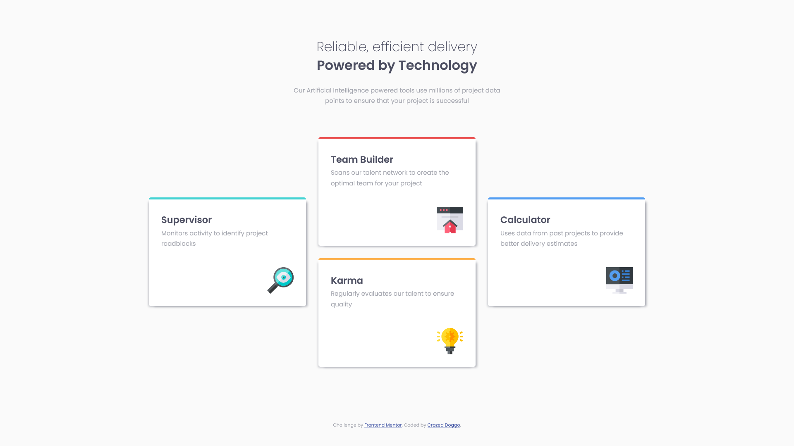

# Frontend Mentor - Four card feature section solution

This is a solution to the [Four card feature section challenge on Frontend Mentor](https://www.frontendmentor.io/challenges/four-card-feature-section-weK1eFYK). Frontend Mentor challenges help you improve your coding skills by building realistic projects. 

## Table of contents

- [Overview](#overview)
  - [The challenge](#the-challenge)
  - [Screenshot](#screenshot)
  - [Links](#links)
- [My process](#my-process)
  - [Built with](#built-with)
  - [Continued development](#continued-development)
- [Author](#author)

## Overview

### The challenge

Users should be able to:

- View the optimal layout for the site depending on their device's screen size

### Screenshot

### Links

- Solution URL: [https://github.com/CrazedDoggo/FEM-Four-Card-Feature-Section](https://github.com/CrazedDoggo/FEM-Four-Card-Feature-Section)
- Live Site URL: [https://crazeddoggo.github.io/FEM-Four-Card-Feature-Section/](https://crazeddoggo.github.io/FEM-Four-Card-Feature-Section/)

## My process

I firstly built the components and styled the typography for my CSS after completing the HTML, worrying about the layout afterwards.

After finishing the mobile-layout which was easy enough due to it being under a straightfoward normal flow, I moved onto the desktop layout which utilizes grid. I initially tried to create pre-set rows and columns which I would then position the cards on, but after dealing with the 'complexity' of that I reached for a more simple, maintainable function. 

I did so by firstly creating three equal columns (to keep the cards equal widths) and then defined the areas for each card. This allows me to very easily manipulate the positioning of the cards within their areas. The cards initially started to stretch their height to fit their grid area, but simply aligning the items to the center resolved this issue and created the desired layout we wanted, three columns of cards with each exterior card being placed in the center.

### Built with

- Semantic HTML5 markup
- CSS custom properties
- CSS Grid
- Mobile-first workflow

### Continued development

This was the last free "newbie" challenge on FEM and I will now move onto their junior-level challenges. I hope that it challenges me to help with future learning and practice. If it goes easily, then at least I have some confirmation or reassurance that I'm doing well with my learning.

## Author

- GitHub - [CrazedDoggo](https://github.com/CrazedDoggo)
- Frontend Mentor - [@CrazedDoggo](https://www.frontendmentor.io/profile/CrazedDoggo)
- Twitter - [@DoggoCrazed](https://www.twitter.com/DoggoCrazed)
